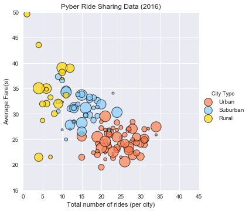
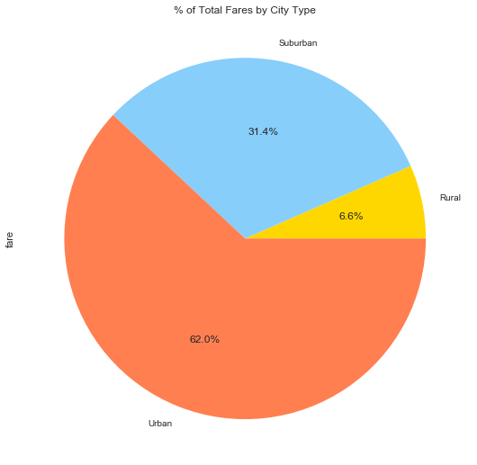
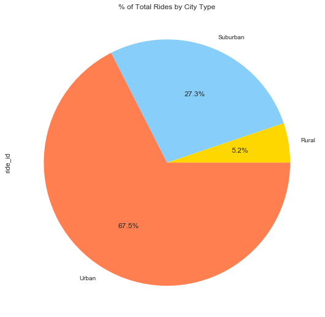
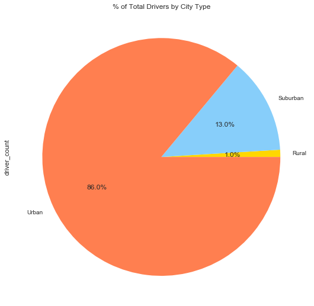

# Pyber Chu Homework
Observable Trend 1: In urban areas, there are cheaper, more uber rides
Observable Trend 2: In rural areas, prices are most expensive and least frequent
Observable Trend 3: Urban areas dominate in fare prices, rides, and driver counts

# Bubble Plot


```python
import matplotlib.pyplot as plt
import pandas as pd
import numpy as np
import os
import plotly.plotly as py
import seaborn as sns
```


```python
#Average Fare ($) Per City
#Total Number of Rides Per City
#Total Number of Drivers Per City
#City Type (Urban, Suburban, Rural)
```


```python
ride_data = pd.read_csv('ride_data.csv')
city_data = pd.read_csv('city_data.csv')
ride_city_df = pd.merge(ride_data, city_data, on="city")
ride_city_df.head()
```


<div>
<style scoped>
    .dataframe tbody tr th:only-of-type {
        vertical-align: middle;
    }

    .dataframe tbody tr th {
        vertical-align: top;
    }

    .dataframe thead th {
        text-align: right;
    }
</style>
<table border="1" class="dataframe">
  <thead>
    <tr style="text-align: right;">
      <th></th>
      <th>city</th>
      <th>date</th>
      <th>fare</th>
      <th>ride_id</th>
      <th>driver_count</th>
      <th>type</th>
    </tr>
  </thead>
  <tbody>
    <tr>
      <th>0</th>
      <td>Sarabury</td>
      <td>2016-01-16 13:49:27</td>
      <td>38.35</td>
      <td>5403689035038</td>
      <td>46</td>
      <td>Urban</td>
    </tr>
    <tr>
      <th>1</th>
      <td>Sarabury</td>
      <td>2016-07-23 07:42:44</td>
      <td>21.76</td>
      <td>7546681945283</td>
      <td>46</td>
      <td>Urban</td>
    </tr>
    <tr>
      <th>2</th>
      <td>Sarabury</td>
      <td>2016-04-02 04:32:25</td>
      <td>38.03</td>
      <td>4932495851866</td>
      <td>46</td>
      <td>Urban</td>
    </tr>
    <tr>
      <th>3</th>
      <td>Sarabury</td>
      <td>2016-06-23 05:03:41</td>
      <td>26.82</td>
      <td>6711035373406</td>
      <td>46</td>
      <td>Urban</td>
    </tr>
    <tr>
      <th>4</th>
      <td>Sarabury</td>
      <td>2016-09-30 12:48:34</td>
      <td>30.30</td>
      <td>6388737278232</td>
      <td>46</td>
      <td>Urban</td>
    </tr>
  </tbody>
</table>
</div>


```python
ride_city = ride_city_df.set_index("city")
```


```python
#Average Fare $ Per city
average_fare = ride_city_df.groupby("city")['fare'].mean()
average_fare=average_fare.round(2)
average_fare.head()

```


    city
    Alvarezhaven    23.93
    Alyssaberg      20.61
    Anitamouth      37.32
    Antoniomouth    23.62
    Aprilchester    21.98
    Name: fare, dtype: float64


```python
#Drivers Per city
total_drivers = ride_city_df.groupby("city")['driver_count'].unique().str.get(0)
total_drivers.head()
```


    city
    Alvarezhaven    21
    Alyssaberg      67
    Anitamouth      16
    Antoniomouth    21
    Aprilchester    49
    Name: driver_count, dtype: int64


```python
#Total Number of Rides Per City
totalrides_city = ride_city_df.groupby("city")['ride_id'].count()
totalrides_city.head()
```


    city
    Alvarezhaven    31
    Alyssaberg      26
    Anitamouth       9
    Antoniomouth    22
    Aprilchester    19
    Name: ride_id, dtype: int64


```python
#City Type
city_type = ride_city_df.groupby("city")["type"].unique().str.get(0)
city_type1=city_type.replace('Urban',1)
city_type2=city_type1.replace('Suburban',2)
city_type3=city_type2.replace('Rural',3)
city_type3.head()
```


    city
    Alvarezhaven    1
    Alyssaberg      1
    Anitamouth      2
    Antoniomouth    1
    Aprilchester    1
    Name: type, dtype: int64


```python
df=pd.DataFrame({'Total Rides':totalrides_city,
              'Total Drivers': total_drivers,
              'Average Fare': average_fare,
              'City Type': city_type})
df.head()
```


<div>
<style scoped>
    .dataframe tbody tr th:only-of-type {
        vertical-align: middle;
    }

    .dataframe tbody tr th {
        vertical-align: top;
    }

    .dataframe thead th {
        text-align: right;
    }
</style>
<table border="1" class="dataframe">
  <thead>
    <tr style="text-align: right;">
      <th></th>
      <th>Average Fare</th>
      <th>City Type</th>
      <th>Total Drivers</th>
      <th>Total Rides</th>
    </tr>
    <tr>
      <th>city</th>
      <th></th>
      <th></th>
      <th></th>
      <th></th>
    </tr>
  </thead>
  <tbody>
    <tr>
      <th>Alvarezhaven</th>
      <td>23.93</td>
      <td>Urban</td>
      <td>21</td>
      <td>31</td>
    </tr>
    <tr>
      <th>Alyssaberg</th>
      <td>20.61</td>
      <td>Urban</td>
      <td>67</td>
      <td>26</td>
    </tr>
    <tr>
      <th>Anitamouth</th>
      <td>37.32</td>
      <td>Suburban</td>
      <td>16</td>
      <td>9</td>
    </tr>
    <tr>
      <th>Antoniomouth</th>
      <td>23.62</td>
      <td>Urban</td>
      <td>21</td>
      <td>22</td>
    </tr>
    <tr>
      <th>Aprilchester</th>
      <td>21.98</td>
      <td>Urban</td>
      <td>49</td>
      <td>19</td>
    </tr>
  </tbody>
</table>
</div>


```python
#plt.title("Pyber Ride Sharing Data (2016)")
#plt.xlabel("Total number of rides (per city)")
#plt.ylabel("Average Fare(s)")

#plt.ylim(15,55)
#plt.xlim(0,40)

#plt.scatter(totalrides_city, 
            #average_fare, 
            #marker='o', 
            #edgecolors = 'black', 
            #alpha=.75, 
            #s=total_drivers*10,
            #c=city_type3,
            #cmap='viridis')
#figsize=(20,5)
```


```python
#flatui= ["#9b59b6", "#3498db", "#95a5a6", "#e74c3c", "#34495e", "#2ecc71"]
colors=['#FF7F50','#87CEFA','#FFD700']
sns.lmplot(x="Total Rides", 
           y="Average Fare",
           data = df,
           fit_reg=False,
           hue= "City Type",
          palette = colors,
          scatter_kws={"s": total_drivers*5, 
                       "alpha":0.7, 
                       "linewidth":1, 
                       "edgecolor":"black"
                      })
plt.title("Pyber Ride Sharing Data (2016)")
plt.ylim(15,50)
plt.xlim(0,45)
plt.xlabel("Total number of rides (per city)")
plt.ylabel("Average Fare(s)")
```


    Text(32.9163,0.5,'Average Fare(s)')





```python
#% of Total Fares by City Type
fares_citytype = ride_city.groupby('type')['fare'].sum()
plt.axis("equal")
fare_citychart = fares_citytype.plot(kind='pie', figsize=(6,6), title="% of Total Fares by City Type", autopct="%1.1f%%", colors=('#FFD700','#87CEFA','#FF7F50'))
```





```python
#% of Total Rides by City Type
totalrides_citytype = ride_city.groupby('type')['ride_id'].count()
plt.axis("equal")
rides_citychart = totalrides_citytype.plot(kind='pie', figsize=(6,6), title="% of Total Rides by City Type", autopct="%1.1f%%",  colors=('#FFD700','#87CEFA','#FF7F50'))
```





```python
#% of Drivers by City type
totaldrivers_citytype = ride_city.groupby('type')['driver_count'].sum()
plt.axis("equal")
drivers_citychart = totaldrivers_citytype.plot(kind='pie', figsize=(6,6), title="% of Total Drivers by City Type", autopct="%1.1f%%",  colors=('#FFD700','#87CEFA','#FF7F50'))
```




